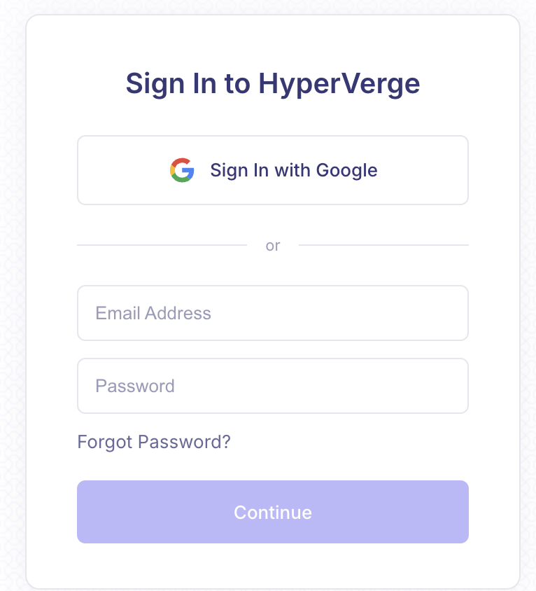
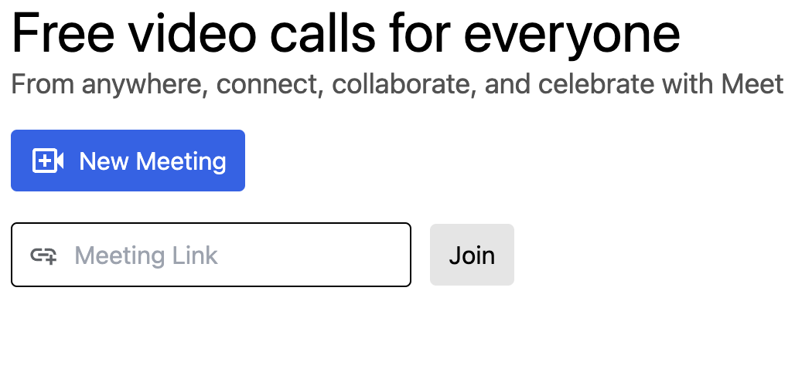
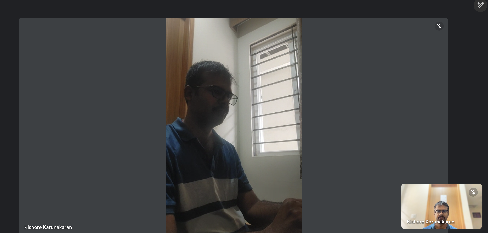

# Claude

Let's build an aws chime video call application using aws chime js SDK, AWS Lambda golang gin, Dynamodb, AWS Cognito for authentication, API Gateway, AWS amplify with Svelte 5 and typescript. Finally Aws CDK with typescript for deployment. The product should have following features

* Authentication Page - This page contains login using google(only google is essential) or login via email and password. Also we need to have register option where user should receive an email to activate the account. Below is the sample page

* Join meeting page - After login we have meeting join page where user can generate a link or join a meeting using the generated link id. Below is the sample screen. In this page user should be able to logout or join the call or create a new meeting id using New Meeting.

* Video call page - Where both the user joins the video call. In the video call the current user video should be small at the right side and the other user video call should be bigger as shown in below. There will be only two users who will be joining the call. Once both the users successfully joined the call we need to start the recording. Once the last user closes the call we need to stop the recording. The recording file should be saved in S3.

* We will be following mono repo which contains all the backend and front end code.
* There should be two golang lambdas
  * meet-service - Responsible for
    * Login
    * Logout
    * Register
    * Meeting Link Generation
    * Join the meeting
    * Starting the recording
    * Stopping the recording
  * meet-authentication - Lambda authorizer
    * Validates the JWT token with Cognito
* All the lambda's should be able to run in local using golang local http server
* We will be using dynamodb as database, For running in local we need to have all the migrations under migration.sh file
* meet-client our svelte 5 frontend application which we will be deploying to aws amplify
  * We will be using shadcn-svelte for UI components
  * Proper handling of refresh(30 mins) and auth token(15 mins) where tokens are generated in backend and authorized via lambda authorizer
  * For the video call, aws chime JS sdk supports apaptive bit rate for low speed internet we need to incorporate it. 
  * We need to ensure that video calling is supported in all the mobile web browsers.
  * we need to ensure the web-app is as much lightweight as possible.
* meet-deployment - AWS CDK using typescript

Can you generate this complete project as step by step ? Please ensure the UI page is lightweight and backend is robust for maximum performance. 
